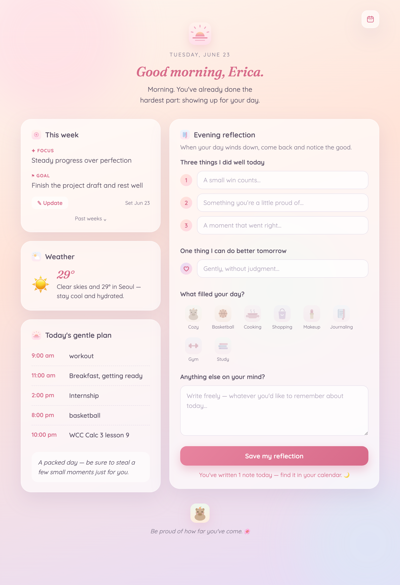
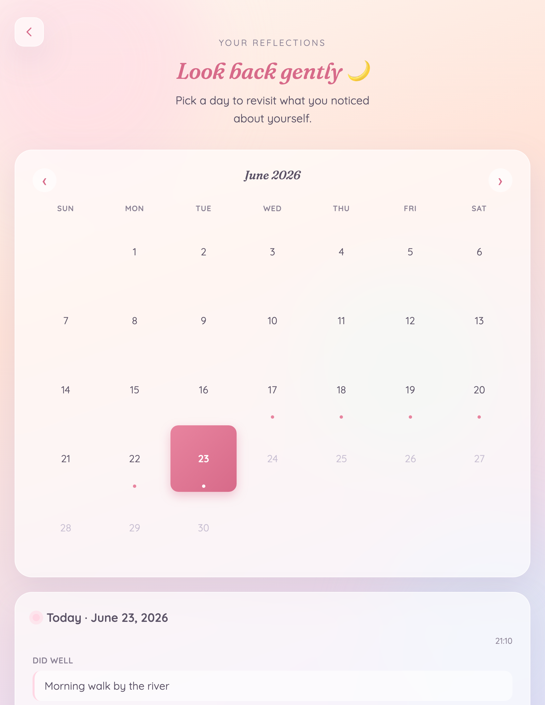

<p align="center">
  
</p>

# 🌿 Morning Check-in

A peaceful, pastel **local web page** to start your day: it shows today's Google
Calendar events with a warm, motivating note, then in the evening lets you
reflect on **3 things you did well** and **1 thing to do better tomorrow**.
A built-in calendar lets you look back on any past day's reflection.

Everything runs on your own computer (`localhost`). Your calendar is read
privately through its **"secret iCal address"** — there's no OAuth and no Google
Cloud project, and nothing leaves your machine except a read-only fetch of your
own calendar feed.

<p align="center">
  
</p>

## ✨ Features

- Today's Google Calendar events, in your timezone (recurring events handled)
- A gentle greeting + schedule note that **changes once per day**
- Evening reflection form (3 wins + 1 improvement), saved per day
- A calendar page to revisit past reflections — opens on today by default

<p align="center">
  
</p>

## ✅ Requirements

- **Python 3.9+** (works great on 3.13)
- A **Google Calendar** (and a computer browser to grab its private iCal link)

## 🚀 Setup

**1. Clone & install**
```bash
git clone <your-repo-url> morning-checkin
cd morning-checkin
python3 -m venv venv
./venv/bin/pip install -r requirements.txt
```

**2. Connect *your* Google Calendar**
```bash
cp config.example.json config.json
```
Then get your calendar's private link:
1. Open **Google Calendar in a browser** (this isn't available in the phone app).
2. Hover your calendar in the left sidebar → **⋮ → Settings and sharing**.
3. Scroll to **Integrate calendar** → copy **Secret address in iCal format**
   (a long URL ending in `.ics`).
4. Paste it into `config.json` as `"ical_url"`. Optionally set `"display_name"`
   (for "Good morning, ___") and `"timezone"` (e.g. `America/New_York`,
   `Asia/Seoul`, `Europe/London`).

> 🔒 That secret URL is read-only but private to you. `config.json` is
> **git-ignored** so it never gets committed — keep it that way.

**3. Run it**
```bash
./venv/bin/python app.py
```
Open **http://127.0.0.1:5001** in your browser. 🎉

## 📔 Your reflections

Each day is saved as `journal/YYYY-MM-DD.json`. The `journal/` folder is
**git-ignored**, so your reflections stay private and local. Reopen the page
later the same day to keep adding to that day's entry, or use the 📅 button to
browse past days.

## ⏰ Run it automatically every morning (macOS — optional)

So you never have to start it by hand, you can have macOS launch it at login
with a **LaunchAgent**. A template is included at
[`deploy/com.morningcheckin.plist`](deploy/com.morningcheckin.plist).

```bash
# 1. Copy the template into your LaunchAgents folder
cp deploy/com.morningcheckin.plist ~/Library/LaunchAgents/

# 2. Edit it: replace /ABSOLUTE/PATH/TO/morning-checkin with this folder's real
#    path (run `pwd` to get it), in all three places.
#    (open ~/Library/LaunchAgents/com.morningcheckin.plist in any editor)

# 3. Start it (and have it start at every login)
launchctl load -w ~/Library/LaunchAgents/com.morningcheckin.plist

# Check it's running (a PID and exit status 0 = healthy):
launchctl list | grep morningcheckin
```
To stop it: `launchctl unload ~/Library/LaunchAgents/com.morningcheckin.plist`.
To remove it: unload, then delete the plist file.

> **macOS + iCloud tip:** if this folder lives in `~/Documents` or `~/Desktop`
> with iCloud sync on, a background LaunchAgent can fail to read files that
> iCloud has evicted to the cloud. Keep the project in a **local** folder (e.g.
> your home directory), not an iCloud-synced one.

On Linux you can do the same idea with a small **systemd user service**; on any
OS you can simply run `./venv/bin/python app.py` whenever you want it.

## 🛠 Notes

- Serves on **port 5001** (port 5000 is used by macOS AirPlay Receiver).
- If the calendar can't be reached, the page still works for reflecting.
- Built with Flask + `icalendar` + `recurring-ical-events`.

## 📄 License

[MIT](LICENSE) — free to use, change, and share.
